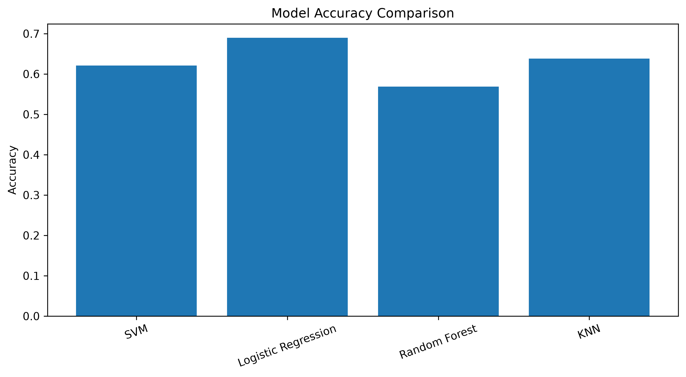
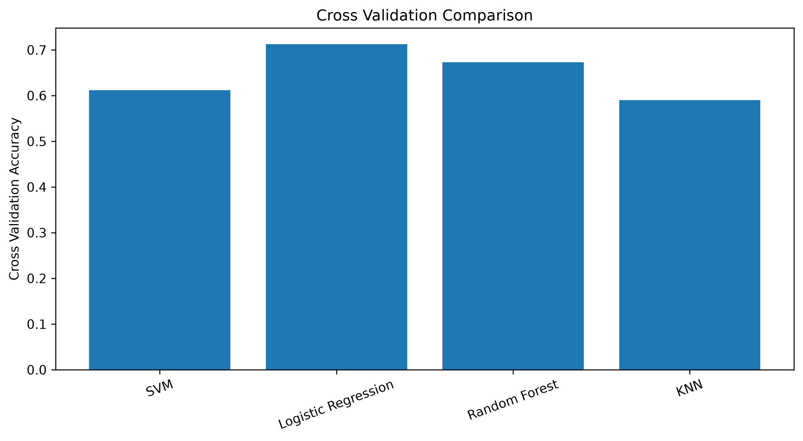
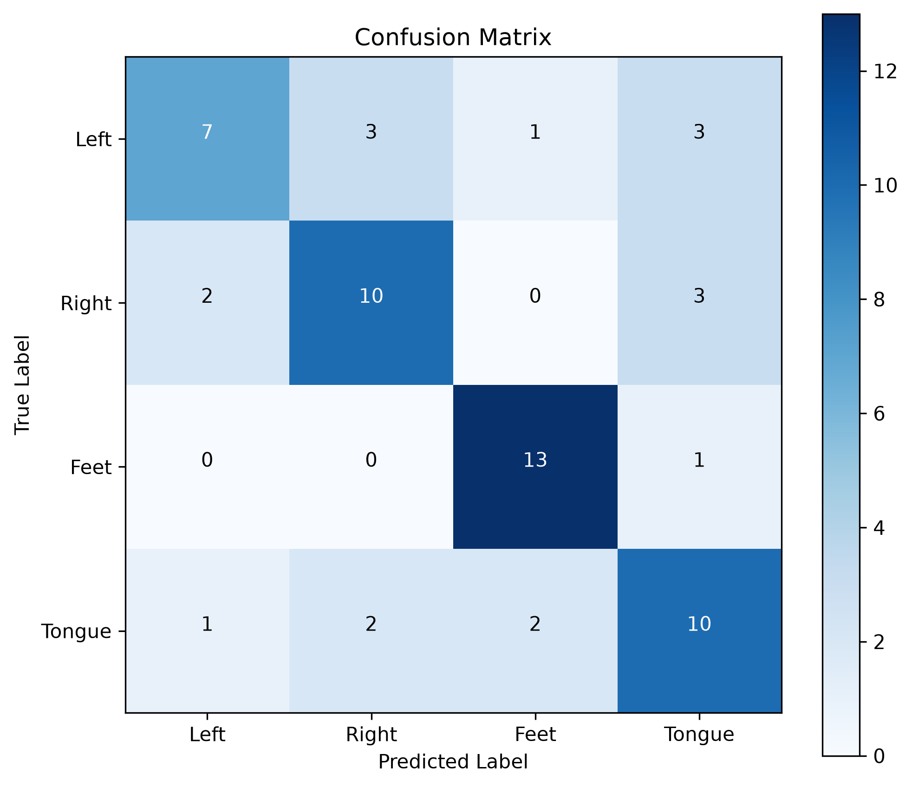

# 🧠 NeuroBench

> **An End-to-End EEG Motor Imagery Classification Framework using Classical Machine Learning and Deep Learning**


---

# 📖 Overview

NeuroBench is an end-to-end Brain-Computer Interface (BCI) project that performs **EEG Motor Imagery Classification** using the **BCI Competition IV Dataset 2a**.

The project explores the complete machine learning pipeline—from raw EEG signal preprocessing to feature engineering, model training, evaluation, visualization, and deep learning.

Unlike many repositories that only train a model, NeuroBench focuses on building an explainable EEG decoding pipeline while documenting each machine learning concept involved.

The project is divided into two stages:

- **Stage 1 – Classical Machine Learning (Completed)**
- **Stage 2 – EEGNet Deep Learning (Currently Under Development)**

The long-term objective is to compare traditional machine learning approaches against modern deep learning architectures and ultimately improve cross-subject EEG generalization.

---

# 🎯 Motivation

Electroencephalography (EEG) signals are among the most challenging biological signals to classify because they are:

- Extremely noisy
- Subject-dependent
- Non-stationary
- Low Signal-to-Noise Ratio (SNR)

Traditional machine learning methods rely on handcrafted feature extraction techniques such as **Common Spatial Pattern (CSP)**, whereas modern deep learning architectures learn feature representations directly from raw EEG.

This project aims to understand and compare both approaches while building an industry-level machine learning pipeline.

---

# 📂 Repository Structure

```text
NeuroBench/

datasets/
│
├── A01T.gdf
├── A02T.gdf
├── ...
│
models/
│
├── best_model.pkl
├── csp.pkl
└── eegnet_best.pt (coming soon)
│
results/
│
├── figures/
│   ├── confusion_matrix.png
│   ├── model_accuracy.png
│   └── cross_validation.png
│
└── metrics/
    ├── classification_report.csv
    ├── confusion_matrix.csv
    └── model_comparison.csv

src/

├── dataset_loader.py
├── preprocessing.py
├── feature_extraction.py
├── classical_models.py
├── hyperparameter_tuning.py
├── visualization.py
├── dataset.py
├── trainer.py

train.py
train_eegnet.py

README.md
```

---

# 📊 Dataset

**BCI Competition IV Dataset 2a**

Characteristics

| Property | Value |
|-----------|-------|
| Subjects | 9 |
| EEG Channels | 22 |
| EOG Channels | 3 |
| Classes | 4 |
| Sampling Frequency | 250 Hz |

Motor Imagery Classes

| Label | Class |
|-------|--------|
| 7 | Left Hand |
| 8 | Right Hand |
| 9 | Feet |
| 10 | Tongue |

Each trial consists of a **4-second motor imagery task**, making it suitable for EEG decoding research.

---

# 🧠 Classical Machine Learning Pipeline

```text
Raw EEG (.gdf)

        │

        ▼

Load Dataset using MNE

        │

        ▼

Power Line Noise Removal
(Notch Filter - 50 Hz)

        │

        ▼

Bandpass Filtering
(8–30 Hz)

        │

        ▼

Motor Imagery Event Extraction

        │

        ▼

Epoch Creation
(2s – 6s)

        │

        ▼

EEG Channel Selection

        │

        ▼

Feature Engineering
(Common Spatial Pattern)

        │

        ▼

Classical Machine Learning

        │

        ▼

Cross Validation

        │

        ▼

Evaluation Metrics

        │

        ▼

Visualization
```

---

# ⚙️ Machine Learning Concepts Used

| Concept | Purpose | Implementation |
|----------|----------|----------------|
| Digital Signal Processing | Remove unwanted EEG frequencies | Notch Filter & Bandpass Filter |
| Feature Engineering | Extract discriminative EEG features | Common Spatial Pattern (CSP) |
| Supervised Learning | Train classification models | SVM, Random Forest, Logistic Regression, KNN, Decision Tree, Naive Bayes |
| Hyperparameter Optimization | Improve model performance | GridSearchCV |
| Cross Validation | Estimate model generalization | 5-Fold Cross Validation |
| Model Evaluation | Measure classifier performance | Accuracy, Precision, Recall, F1 Score |
| Data Visualization | Compare models visually | Matplotlib |

---

# 🔬 EEG Preprocessing

## 1. Raw EEG Loading

The EEG recordings are loaded using **MNE-Python**, which provides native support for GDF files.

Purpose:

- Read EEG recordings
- Preserve metadata
- Extract annotations

---

## 2. Notch Filtering

Power line interference introduces unwanted electrical noise into EEG recordings.

A **50 Hz notch filter** removes this interference while preserving useful brain activity.

```text
Frequency Removed

50 Hz
```

---

## 3. Bandpass Filtering

Motor imagery information is primarily contained within the **Mu** and **Beta** rhythms.

Therefore, only frequencies between

```text
8 Hz – 30 Hz
```

are retained.

Benefits

- Removes low-frequency drift
- Removes high-frequency noise
- Improves Signal-to-Noise Ratio

---

## 4. Event Extraction

Motor imagery events are extracted from EEG annotations.

The events are mapped to

- Left Hand
- Right Hand
- Feet
- Tongue

---

## 5. Epoch Creation

Continuous EEG recordings are segmented into individual trials.

Time Window

```text
2 sec → 6 sec
```

Output

```text
22 EEG Channels

×

1001 Time Samples
```

---

# 🧩 Feature Engineering

## Common Spatial Pattern (CSP)

One of the most widely used feature extraction techniques for EEG classification.

Purpose

To maximize variance for one motor imagery class while minimizing variance for another.

Pipeline

```text
Raw EEG

↓

Spatial Filters

↓

Reduced Feature Vector

↓

Machine Learning Model
```

Advantages

- Improves class separability
- Reduces dimensionality
- Enhances classifier performance

---

# 🤖 Classical Machine Learning Models

The project currently evaluates multiple supervised learning algorithms.

| Model | Purpose |
|--------|----------|
| Support Vector Machine (RBF) | Baseline classifier |
| Logistic Regression | Linear probabilistic classifier |
| Random Forest | Ensemble learning |
| K-Nearest Neighbors | Distance-based classification |
| Decision Tree | Rule-based classification |
| Gaussian Naive Bayes | Probabilistic classifier |

Each model is independently trained and evaluated.

---

# 🔍 Hyperparameter Optimization

The Support Vector Machine is optimized using **GridSearchCV**.

Parameters optimized

| Parameter | Description |
|-----------|-------------|
| C | Controls margin penalty |
| gamma | Controls kernel influence |
| kernel | Decision boundary function |

Grid Search evaluates multiple parameter combinations and selects the highest-performing configuration using cross validation.

---

# 📈 Evaluation Methods

| Evaluation Method | Purpose | Importance |
|-------------------|----------|------------|
| Accuracy | Percentage of correctly classified trials | Overall model performance |
| 5-Fold Cross Validation | Estimates generalization | Prevents overfitting |
| Classification Report | Precision, Recall and F1 Score | Per-class evaluation |
| Confusion Matrix | Visualizes class-wise predictions | Detects class confusion |
| Grid Search | Hyperparameter optimization | Improves classifier performance |

---

# 📊 Results

Current Baseline

| Model | Accuracy |
|--------|-----------|
| CSP + SVM | ~70% |

Detailed metrics are automatically exported to

```text
results/metrics/
```

---

# 📷 Visualizations

## Model Accuracy Comparison

Compares the classification accuracy of different classical machine learning models.

```markdown

```

---

## Cross Validation Comparison

Illustrates the average cross-validation score for each classifier.

```markdown

```

---

## Confusion Matrix

Displays class-wise prediction performance and highlights where misclassifications occur.

```markdown

```

---

# 🧠 EEGNet Implementation (Current Progress)

The project is currently being extended with **EEGNet**, a compact convolutional neural network specifically designed for EEG decoding.

### Why EEGNet?

Unlike CSP, EEGNet automatically learns spatial and temporal representations directly from raw EEG signals.

This eliminates the need for handcrafted feature engineering.

---

## Current Progress

### Completed

- Installed PyTorch
- Installed Braindecode
- Selected official EEGNet implementation
- Created custom PyTorch Dataset
- Implemented DataLoader pipeline
- Implemented Trainer class
- Implemented training loop
- Added GPU support
- Added model checkpoint saving
- Integrated EEG preprocessing with PyTorch pipeline

---

### Current Challenge

The current implementation encounters a tensor dimensionality mismatch inside Braindecode.

Current Error

```text
einops.EinopsError

Shape mismatch
```

Reason

Braindecode expects a different tensor layout than the one currently produced by the preprocessing pipeline.

The remaining work involves correctly formatting EEG tensors before model training.

---

## Planned Deep Learning Pipeline

```text
Raw EEG

↓

Filtering

↓

Epoch Creation

↓

Tensor Conversion

↓

EEGNet

↓

Training

↓

Evaluation

↓

Comparison with CSP + SVM
```

---

# 💻 Skills Demonstrated

## Machine Learning

- Supervised Learning
- Hyperparameter Optimization
- Cross Validation
- Feature Engineering
- Model Evaluation

---

## Signal Processing

- EEG Preprocessing
- Digital Filtering
- Event Extraction
- Epoch Creation

---

## Python Libraries

- NumPy
- Pandas
- Matplotlib
- MNE-Python
- Scikit-Learn
- PyTorch
- Braindecode

---

## Brain Computer Interfaces

- EEG Signal Processing
- Motor Imagery Classification
- Common Spatial Pattern
- EEGNet (Work in Progress)

---

# 🚀 Future Work

- Complete EEGNet implementation
- Compare Classical ML vs Deep Learning
- Add Early Stopping
- Add Learning Rate Scheduler
- Plot Training & Validation Curves
- Implement EEG Conformer
- Cross-Subject Evaluation
- Leave-One-Subject-Out Validation
- Transfer Learning
- Domain Adaptation

---

# 📚 References

- BCI Competition IV Dataset 2a
- EEGNet: A Compact Convolutional Neural Network for EEG-based Brain–Computer Interfaces (Lawhern et al.)
- MNE-Python Documentation
- Scikit-Learn Documentation
- PyTorch Documentation
- Braindecode Documentation

---
